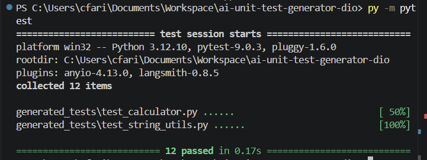
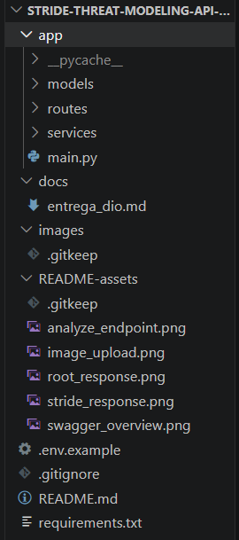
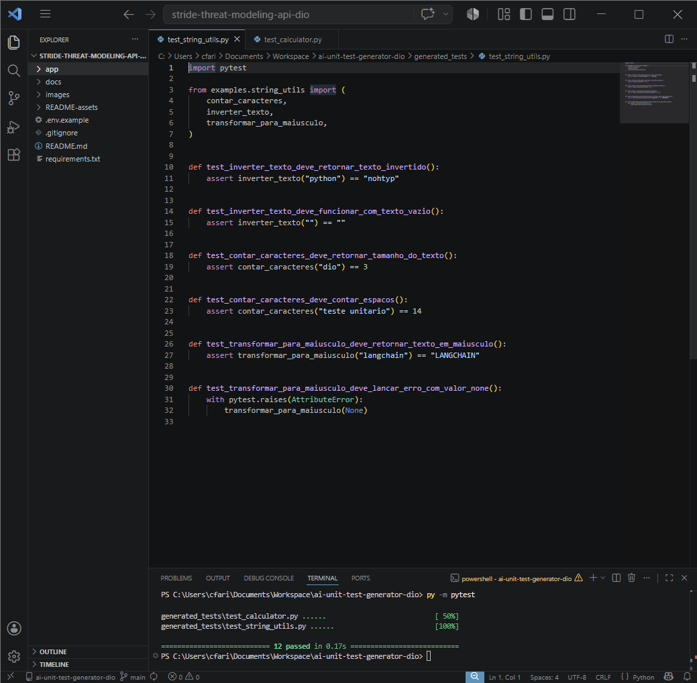
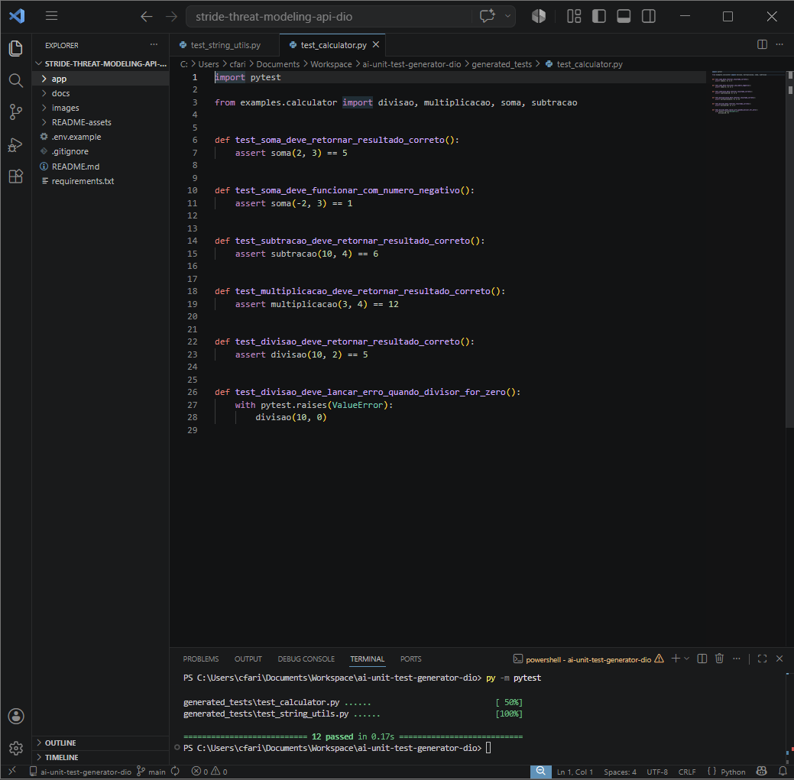

# ai-unit-test-generator-dio

projeto de estudo da dio sobre geração de testes unitários com python.

a ideia é simples: ler arquivos `.py`, montar um prompt, simular a resposta de uma llm local e salvar testes em pytest na pasta `generated_tests/`.

o projeto usa langchain para organizar o prompt, um mock llm local para não depender de chave de api, engenharia de prompts para guiar a geração dos testes e pytest para validar o resultado.

a estrutura também está preparada para uma integração com azure openai, mas aqui ela fica só como base de estudo. o fluxo usado no projeto roda com o mock local.

## objetivo

criar um gerador simples que:

- lê um arquivo python
- gera testes unitários com pytest
- salva os testes em `generated_tests/`
- cobre casos de sucesso
- cobre casos de erro quando faz sentido
- mantém uma estrutura fácil de adaptar para azure openai

## como funciona

o fluxo principal fica em `app/generator.py`.

ele faz quatro coisas:

1. lê o arquivo python de entrada
2. monta um prompt usando `app/prompts.py`
3. chama o `MockLLM`, que simula uma resposta de modelo
4. salva o teste gerado na pasta `generated_tests/`

os arquivos de exemplo ficam em `examples/`.

os testes gerados ficam em `generated_tests/`.

## estrutura

```text
ai-unit-test-generator-dio/
├── README.md
├── requirements.txt
├── .env.example
├── .gitignore
├── app/
│   ├── generator.py
│   ├── mock_llm.py
│   ├── prompts.py
│   └── utils.py
├── docs/
│   └── entrega_dio.md
├── examples/
│   ├── calculator.py
│   └── string_utils.py
├── generated_tests/
│   ├── test_calculator.py
│   └── test_string_utils.py
└── README-assets/
    ├── generated_calculator_tests.png
    ├── generated_string_tests.png
    ├── project_structure.png
    └── pytest_success.png
```

## uso do langchain

o langchain é usado na montagem do prompt com `PromptTemplate`.

isso deixa o texto do prompt separado do gerador e facilita ajustes na engenharia de prompts sem mexer no restante do fluxo.

## mock llm local

o projeto usa um mock llm local para gerar respostas previsíveis.

isso ajuda no estudo porque o projeto roda sem azure, sem chave de api e sem consumo externo. a ideia principal continua aparecendo: transformar código fonte em contexto para uma llm e receber testes prontos para executar.

## estrutura para azure openai

o arquivo `.env.example` mostra as variáveis esperadas para uma integração com azure openai:

```env
AZURE_OPENAI_ENDPOINT=
AZURE_OPENAI_KEY=
AZURE_OPENAI_DEPLOYMENT=
```

essa estrutura existe para deixar o projeto preparado para adaptação. neste estudo, o fluxo executado usa o `MockLLM`.

## engenharia de prompts

o prompt orienta a geração para retornar:

- código python válido
- testes com pytest
- funções com prefixo `test_`
- casos positivos
- casos de erro quando fizer sentido
- resposta sem markdown

com isso, o conteúdo gerado pode ser salvo direto em um arquivo de teste.

## exemplos usados

`examples/calculator.py` tem funções simples de calculadora:

- soma
- subtração
- multiplicação
- divisão

a função de divisão lança `ValueError` quando o divisor é zero.

`examples/string_utils.py` tem funções simples para texto:

- inverter texto
- contar caracteres
- transformar texto para maiúsculo

## o que foi feito

- leitura de arquivos python
- geração de testes pytest
- testes para funções de calculadora
- testes para funções de string
- execução com pytest
- resultado final com 12 testes passando

## como executar

crie e ative um ambiente virtual:

```bash
python -m venv .venv
```

no windows:

```bash
.venv\Scripts\activate
```

instale as dependências:

```bash
pip install -r requirements.txt
```

gere testes para a calculadora:

```bash
python -m app.generator examples/calculator.py
```

gere testes para as funções de string:

```bash
python -m app.generator examples/string_utils.py
```

## como rodar os testes

execute:

```bash
pytest
```

ou rode apenas a pasta de testes gerados:

```bash
pytest generated_tests
```

## prints do projeto

### pytest passando


### estrutura do projeto


### testes gerados para string_utils


### testes gerados para calculator


## conclusão

este é um projeto educacional, feito para praticar a ligação entre ia generativa e testes automatizados.

mesmo usando um mock llm, o fluxo mostra a ideia central: ler código, montar um prompt, gerar testes e validar tudo com pytest.
